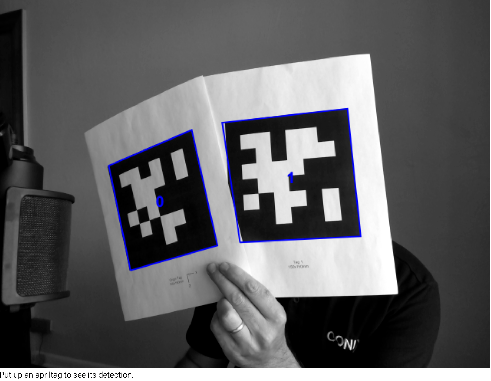

# Apriltag WASM Detector Standalone Repo

Apriltag detector using the apriltag C library at [https://github.com/AprilRobotics/apriltag](https://github.com/AprilRobotics/apriltag), and compiled to WASM using emscripten.

This is the main WASM apriltag detector source, with additional tests and a [standalone javascript application](https://conix-center.github.io/apriltag-js-standalone/) that displays the detector output. This allows to develop and test the detector, and then transfer the source to the main [ARENA-core source](https://github.com/conix-center/ARENA-core/tree/master/apriltag).

**Apriltags in the browser**


## Contents

- **apriltag**: submodule of the apriltag library source repository ([https://github.com/AprilRobotics/apriltag](https://github.com/AprilRobotics/apriltag))
- **bin**: where the resulting binaries are placed
- **docs**: doxygen documentation of the detector C source; [see the docs](https://conix-center.github.io/apriltag-js-standalone/docs/files.html).
- **html**: standalone javascript application that displays the detector output; live [here](https://conix-center.github.io/apriltag-js-standalone/).
- **log**: where valgrind logs are placed
- **src**: the detector source
- **test**: cmocka tests
- **test/tag-imgs**: test input images

## Quick Start

Install make, gcc, [emscripten](https://emscripten.org/docs/getting_started/downloads.html), [cmocka](https://cmocka.org/), [valgrind](https://www.valgrind.org/downloads/?src=www.discoversdk.com), and [doxygen](https://www.doxygen.nl/manual/install.html).  Cmocka and valgrind are only necessary to run the tests and memory checks. Doxygen is needed if you want to build the documentation.

To compile and run tests, use make:

```make <target>```

The Makefile has the following targets:

- **all**: Builds the example binary (atagjs_example) and the WASM files (apriltag_wasm.js).
- **atagjs_example** (default): Creates a binary (at bin/atagjs_example) of an example program that get the detector output by giving it image files. The image files are indicated as arguments to the program (requires gcc).
- **apriltag_wasm.js**: Builds the WASM detector (requires emscripten). The resulting files (**apriltag_wasm.js** and **apriltag_wasm.wasm**) are placed under the [html(html) folder so they are run with the javascript example there.
- **tests**: Builds the cmocka test runner as executes it (requires cmocka).
- **valgrind**: Runs the test program under valgrind for several input images in [test/tag-imgs](test/tag-imgs) (requires valgrind).
- **clean**: Cleans non-source files.
- **help**: outputs description of targets.

# Detector Details

The apriltag detector uses the [tag36h11](http://ptolemy.berkeley.edu/ptolemyII/ptII11.0/ptII/doc/codeDoc/edu/umich/eecs/april/tag/Tag36h11.html) family ([pre-generated tags](https://github.com/conix-center/apriltag-gen)). For tag pose estimation, tag sizes are assumed to be fixed, according to the tag id, as shown in the table.

| Tag ID Range | Tag Size (mm) |
| ------------ | ------------- |
| [0,150]      | 150           |
| [151,300]    | 100           |
| [301,450]    | 50            |
| [451,586]    | 20            |

See pre-generated tags with the right size here: https://github.com/conix-center/apriltag-gen

## Detector API

The C detector documentation is [here](https://conix-center.github.io/apriltag-js-standalone/docs/files.html). The detector calls are documented in [apriltag_js.c](https://conix-center.github.io/apriltag-js-standalone/docs/apriltag__js_8h.html). A usage example can be found at [atagjs_example](src/atagjs_example.c).

When running in a browser, the C code is compiled to WASM and wrapped by the javascript class [Apriltag](html/apriltag.js) using emscripten's [cwrap()](https://emscripten.org/docs/api_reference/preamble.js.html#cwrap). The detector C calls are private to the **[Apriltag](html/apriltag.js)** class, which exposes the following calls:

- Apriltag() constructor. Accepts a callback that will be called when the detector code is fully loaded:

```javascript
let apriltag = Apriltag(() => {
  console.log("Apriltag detector ready.");
});
```

- The ```detect()``` call receives a grayscale image (```grayscaleImg```) with dimensions given by the arguments ```imgWidth``` and ```imgHeight``` in pixels:

```javascript
apriltag.detect(grayscaleImg, imgWidth, imgHeight)
```

> ```detect()``` will return an array of JSON objects with information about the tags detected.
>
> Example detection:
>
> ```json
> [
> {
>  "id": 151,
>  "size": 0.1,
>  "corners": [
>    { "x": 777.52, "y": 735.39},
>    { "x": 766.05, "y": 546.94},
>    { "x": 578.36, "y": 587.88},
>    { "x": 598, "y": 793.42}
>  ],
>  "center": { "x": 684.52, "y": 666.51 },
>  "pose": {            
>    "R": [                                          
>      [ 0.91576, -0.385813, 0.111941 ],             
>      [ -0.335306, -0.887549, -0.315954 ],          
>      [ -0.221252, -0.251803, 0.942148 ] ],         
>    "t": [ 0.873393, 0.188183, 0.080928 ],          
>    "e": 0.000058,                                  
>    "asol":{          
>       "R":[                                        
>          [ 0.892863, -0.092986, -0.440623 ],       
>          [ 0.077304, 0.995574, -0.053454 ],        
>          [ 0.443644, 0.013666, 0.896099 ] ],       
>       "t":[ 0.040853, -0.032423, 1.790318 ],       
>       "e":0.000078                                 
>    }                                               
>  }                    
> }
> ]
> ```
>
> Where:
>
> * *id* is the tag id,
> * *size* is the tag size in meters (based on the tag id)
> * *corners* are x and y corners of the tag (in fractional pixel coordinates)
> * *center* is the center of the tag (in fractional pixel coordinates)
> * *pose*: is the pose estimation, only returned if ```return_pose = 1```
>   * *R* is the rotation matrix (**column major**)
>   * *t* is the translation
>   * *e* is the object-space error of the pose estimation
>   * *asol* is the alternative solution candidate, only returned if ```return_solutions = 1``` (see: [apriltag_pose.h](https://github.com/AprilRobotics/apriltag/blob/master/apriltag_pose.h))

- To compute the pose, the detector needs the camera parameters. To set them, before calling ```detect()```, use ```set_camera_info(fx, fy, cx, cy)```, where
  * *fx*, *fy* is the focal lenght, in pixels
  * *cx*, *cy* is the principal point offset, in pixels

```javascript
apriltag.set_camera_info(fx, fy, cx, cy);
```

- Set the detector maximum number of detections, if it should return pose estimates and details about alternative solutions with ```set_max_detections(maxDetections)```, ```set_return_pose(returnPose)``` and ```set_return_solutions(returnSolutions)```, where
  * *maxDetections* is the maximum number of detections (0=return all)
  * *returnPose* indicates if pose estimates are returned, (0=do not return; 1=return)
  * *returnSolutions* indicates if the alternative pose estimates solution is returned, (0=do not return; 1=return)

```javascript
// return all detections
apriltag.set_max_detections(0);
// return pose estimate
apriltag.set_return_pose(1);
// return pose estimate alternative solution details
apriltag.set_return_solutions(1);
```

### Javascript example

This is an example javascript code snippet that shows how to call ```detect()```, using a video frame already in an html canvas. Before this code, we also need to assign an instance of the [Apriltag](html/apriltag.js) class to the ```apriltag``` variable used in the code and, if we are getting the pose from the detector, we would also need to call ```apriltag.set_camera_info(fx, fy, cx, cy)``` to set the correct camera parameters.

```javascript
// get the video frame
let ctx = canvas.getContext("2d"); // canvas is an html canvas with the video frame
let imageData = ctx.getImageData(0, 0, ctx.canvas.width, ctx.canvas.height);
let imageDataPixels = imageData.data;

// this is the grayscale image we will pass to the detector
let grayscalePixels = new Uint8Array(ctx.canvas.width * ctx.canvas.height);

// convert to grayscale
for (var i = 0, j = 0; i < imageDataPixels.length; i += 4, j++) {
  let grayscale = Math.round((imageDataPixels[i] + imageDataPixels[i + 1] + imageDataPixels[i + 2]) / 3);
  grayscalePixels[j] = grayscale; // single grayscale value
}

// call detect() passing the grayscale image in grayscalePixels. NOTE: **apriltag** is a previously created instance of ```Apriltag```
detections = await apriltag.detect(grayscalePixels, ctx.canvas.width, ctx.canvas.height); // Important: pass a width and height matching the grayscalePixels array size

// do something with the detections returned by detect() ...
```

See the full example in the [html](html) folder, live at [https://conix-center.github.io/apriltag-js-standalone/](https://conix-center.github.io/apriltag-js-standalone/).


## Detector Options

- Change detector options with ```set_max_detections(maxDetections)```, ```set_return_pose(returnPose)``` and ```set_return_solutions(returnSolutions)```. See [Detector API](#detector-api) for details.

### Defaults

The detector is initialized with the following options defined in the [Apriltag](html/apriltag.js) constructor:

```javascript
this._opt = {
  // Decimate input image by this factor
  quad_decimate: 2.0,
  // What Gaussian blur should be applied to the segmented image; standard deviation in pixels
  quad_sigma: 0.0,
   // Use this many CPU threads (no effect)
  nthreads: 1,
  // Spend more time trying to align edges of tags
  refine_edges: 1,
  // Maximum detections to return (0=return all)
  max_detections: 0,
  // Return pose (requires camera parameters)
  return_pose: 1,
  // Return pose solutions details
  return_solutions: 1
}
```

You can edit the [source file](html/apriltag.js) to change these defaults too.
